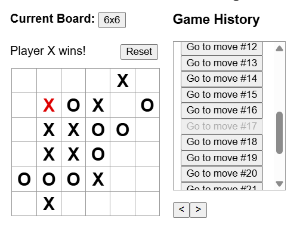

# My Tic-Tac-Toe game

Simple Tic-Tac-Toe game, I wrote in order to learn the basics of React. Modificated version of an [official React tutorial](https://react.dev/learn/tutorial-tic-tac-toe).

## Features

* Different board sizes are supported (not only 3x3)
* Better history navigation
  * Going back in history might be undone (or moves redone), it doesn't delete immediately later history, only if you move something else
  * Selected item in history blanked out
  * Next and previous move buttons
* Last move is highlighted
* Checking of game works up to board size 10x10

## Screenshots

